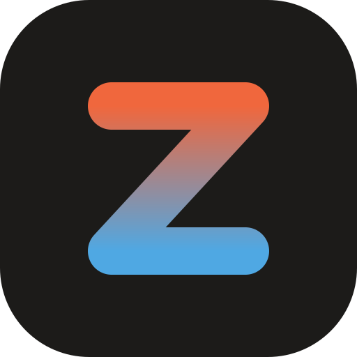

# ZoneTherm brand

The identity for the controller, its web interface, and anything printed
about it. The web UI implements these rules in `Code/webui/src/style.css` and
`Code/webui/src/components/Brand.svelte`; the assets here are the source for
everything else.

## The mark

A **Z drawn as a single pipe run**. The top bar is the supply, the diagonal is
the flow, the bottom bar is the return. The stroke runs from ember at the top to
glacier at the bottom: one plant, two seasons. It sits on an ink tile with a
corner radius of a quarter of the side, so it reads at a 16 px favicon as well
as on a 100 mm enclosure lid.

| File | Use |
|---|---|
| `zonetherm-mark.svg` | The tile mark. Favicons, app icons, avatars, the enclosure. |
| `zonetherm-mark-mono.svg` | The Z alone, one colour. Silkscreen, engraving, one-colour print. |
| `zonetherm-logo.svg` | Horizontal lockup for light backgrounds. README, documentation. |
| `zonetherm-logo-dark.svg` | The same lockup for dark backgrounds. |

Geometry, in the 32-unit tile: the Z spans x 10 to 22 and y 9.5 to 22.5, stroke
width 4.25, round caps and joins. Do not restyle the stroke, add a third colour,
or set the tile on a gradient.

## Wordmark

*ZoneTherm*, one word, capital Z and capital T. Set in Inter (or the system UI
face when Inter is unavailable), semibold, tracked -0.02 em. In running text it
is plain: ZoneTherm. Lowercase `zonetherm` is reserved for hostnames, MQTT
topics and package names.

## Colour

Colour means something or it is not used. The interface is ink on warm-neutral
paper; the three chromatic colours each carry exactly one meaning.

| Token | Light | Dark | Meaning |
|---|---|---|---|
| Paper | `#F2F2EF` | `#131311` | Page background |
| Surface | `#FFFFFF` | `#1B1B18` | Cards, inputs, tables |
| Ink | `#1C1C19` | `#ECEBE6` | Text, every control, the active state |
| Ember | `#CF4A1C` | `#F26A3D` | A zone that is heating right now. Nothing else. |
| Glacier | `#2477B8` | `#5AAEE6` | A zone that is cooling right now. Nothing else. |
| Amber | `#A86500` | `#E0A232` | A thermostat with no signal, a valve nobody owns |
| Signal red | `#B3261E` | `#EF5350` | Errors and destructive actions |

The mark uses slightly brighter ember (`#F0673D`) and glacier (`#4FA8E3`)
because it sits on ink.

## Type

One family, system-served: Inter, then the platform UI face. Five sizes in the
interface: 12, 13, 14 (body), 16 (section titles), 22 (page titles), plus the
44 px room temperature, which is the only large type on any screen. Numbers
that stack use tabular figures. Sentence case everywhere; no all-caps labels.

## Voice

Every page opens with one plain sentence that says what the page currently
shows: "2 of 7 rooms are calling for heat." Copy is specific to the plant
(rooms, valves, thermostats, seasons), never generic ("overview", "dashboard").
No exclamation marks.
